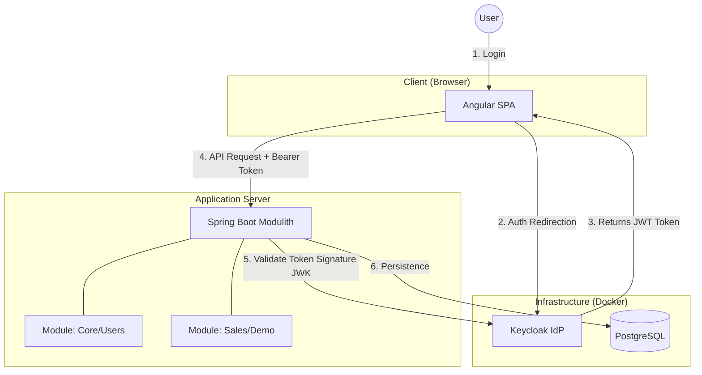

# 🔐 Spring-Angular-Keycloak Lab

### A Full-Stack Integration Lab for Secure Architectures (AuthN/AuthZ with Keycloak).

This repository is a Proof of Concept (PoC) designed to explore and master the integration of a modern Modular Monolith architecture, using Spring Boot for the backend, Angular for the frontend, and Keycloak as the centralized Identity Provider (IdP).

🚫 Disclaimer: This is a personal project for educational and research purposes. It contains no proprietary business logic or real data.

## 🎯 Project Objectives

The main purpose of this lab is to solve common technical challenges in distributed and secure systems:

1. Identity Decoupling: Delegate all authentication and user management to Keycloak (OIDC/OAuth2).

2. Security in Modular Monolith: Implement RBAC (Role-Based Access Control) security at the method and endpoint level in Spring Boot, while maintaining module independence.

3. Transparent User Experience: Integrate Angular with Keycloak to handle tokens, session refreshes, and protected routes (Guards) without friction for the user.

4. Local Orchestration: Configure a reproducible development environment using Docker.

## 🛠️ Tech Stack

### Backend (The Modulith)

- Java 21: Base language.

- Spring Boot 3.5.x: Main framework.

- Spring Security 6: Security management (Resource Server).

- Spring Data JPA: Persistence.

- Structure: Modular Monolith (feature-based or domain-driven packages).

### Frontend (SPA)

- Angular 20+: UI Framework.

- Angular OAuth2 OIDC: Library for handling OpenID Connect flows.

- TailwindCSS: Rapid styling.

### Infrastructure & Identity

- Keycloak (Docker): Identity and Access Management Server.

- PostgreSQL: Relational Database.

- Docker Compose: Container orchestration.

## 🏗️ High-Level Architecture

The system follows a Resource Server pattern. The Frontend does not send credentials to the Backend; it sends an Access Token (JWT) signed by Keycloak.

